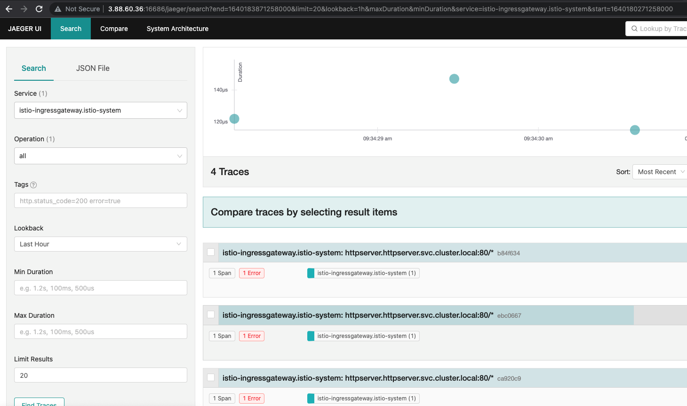

### Module 12 homework
Requirements:
把我们的 httpserver 服务以 Istio Ingress Gateway 的形式发布出来。以下是你需要考虑的几点：
* 如何实现安全保证；
* 七层路由规则；
* 考虑 open tracing 的接入。

### Docker Image
The docker image repository is located at:
* https://hub.docker.com/repository/docker/tonylixu/go_http_server

### Install istio
```bash
$ curl -L https://istio.io/downloadIstio | sh -
$ cd istio-1.12.1/
$ sudo cp bin/istioctl /usr/local/bin
$ istioctl install --set profile=demo -y
✔ Istio core installed
✔ Istiod installed
✔ Ingress gateways installed
✔ Egress gateways installed
✔ Installation complete                                                                                                                                   Making this installation the default for injection and validation.

Thank you for installing Istio 1.12.  Please take a few minutes to tell us about your install/upgrade experience!  https://forms.gle/FegQbc9UvePd4Z9z7
```

### Deploy httpserver
* Create namespace `httpserver`
```bash
$ kubectl create ns httpserver
```
* Enable istio for new namespace:
```bash
$ kubectl label ns httpserver istio-injection=enabled
namespace/httpserver labeled
$ kubectl get ns httpserver --show-labels
NAME         STATUS   AGE   LABELS
httpserver   Active   10d   istio-injection=enabled,kubernetes.io/metadata.name=httpserver
```
* Create httpserver service
```bash
$ kubectl create -f httpserver.yaml
configmap/httpserver created
deployment.apps/httpserver-deployment created
service/httpserver-service created
```

### Generate Certificates and Apply istio spec
* Create certs
```bash
$ openssl req -x509 -sha256 -nodes -days 365 -newkey rsa:2048 -subj '/O=tony Inc./CN=*.tony.io' -keyout tony.io.key -out tony.io.crt
```
* Create secret
```bash
$ $ kubectl create -n istio-system secret tls tony-credential --key=tony.io.key --cert=tony.io.crt
secret/tony-credential created
```
* Apply istio spec
```bash
$ kubectl apply -f istio-spec.yaml -n httpserver
virtualservice.networking.istio.io/httpsserver created
gateway.networking.istio.io/httpsserver created
```

### Check Ingress IP
```bash
$ kubectl get svc -n istio-system
NAME                   TYPE           CLUSTER-IP      EXTERNAL-IP   PORT(S)                                                                      AGE
istio-egressgateway    ClusterIP      10.96.73.3      <none>        80/TCP,443/TCP                                                               19h
istio-ingressgateway   LoadBalancer   10.102.233.41   <pending>     15021:32473/TCP,80:31327/TCP,443:32164/TCP,31400:32050/TCP,15443:30557/TCP   19h
istiod                 ClusterIP      10.97.37.203    <none>        15010/TCP,15012/TCP,443/TCP,15014/TCP                                        19h
```

### Access httpserver via ingress
```bash
$ curl --resolve httpsserver.tony.io:443:10.102.233.41 https://httpsserver.tony.io/healthz -v -k
* Added httpsserver.tony.io:443:10.102.233.41 to DNS cache
* Hostname httpsserver.tony.io was found in DNS cache
*   Trying 10.102.233.41:443...
* TCP_NODELAY set
* Connected to httpsserver.tony.io (10.102.233.41) port 443 (#0)
* ALPN, offering h2
* ALPN, offering http/1.1
* successfully set certificate verify locations:
*   CAfile: /etc/ssl/certs/ca-certificates.crt
  CApath: /etc/ssl/certs
* TLSv1.3 (OUT), TLS handshake, Client hello (1):
* TLSv1.3 (IN), TLS handshake, Server hello (2):
* TLSv1.3 (IN), TLS handshake, Encrypted Extensions (8):
* TLSv1.3 (IN), TLS handshake, Certificate (11):
* TLSv1.3 (IN), TLS handshake, CERT verify (15):
* TLSv1.3 (IN), TLS handshake, Finished (20):
* TLSv1.3 (OUT), TLS change cipher, Change cipher spec (1):
* TLSv1.3 (OUT), TLS handshake, Finished (20):
* SSL connection using TLSv1.3 / TLS_AES_256_GCM_SHA384
* ALPN, server accepted to use h2
...
< HTTP/1.1 200 OK
< date: Wed, 22 Dec 2021 14:22:43 GMT
< content-length: 0
< x-envoy-upstream-service-time: 0
< server: istio-envoy
```

### Install jaeger for tracing
* Install jaeger
```bash
$ k create -f jaeger.yaml
deployment.apps/jaeger created
service/tracing created
service/zipkin created
service/jaeger-collector created

$ ki get po
NAME                                    READY   STATUS    RESTARTS      AGE
istio-egressgateway-65bdddf685-4rgp5    1/1     Running   1 (11h ago)   19h
istio-ingressgateway-7b545cdbc7-hbx8g   1/1     Running   1 (91m ago)   19h
istiod-864977fd6c-hpfrv                 1/1     Running   1 (11h ago)   19h
jaeger-d7849fb76-jdq2p                  1/1     Running   0             16s
```
* Update configmap
```bash
$ ki edit configmap
add
simpling: 100
under tracing
configmap/istio edited
```

### Bring up jaeger dashboard
* Use istioctl dashboard command
```bash
$ istioctl dashboard jaeger --address 0.0.0.0
http://0.0.0.0:16686
Failed to open browser; open http://0.0.0.0:16686 in your browser.
```
* Dashboard screenshot

