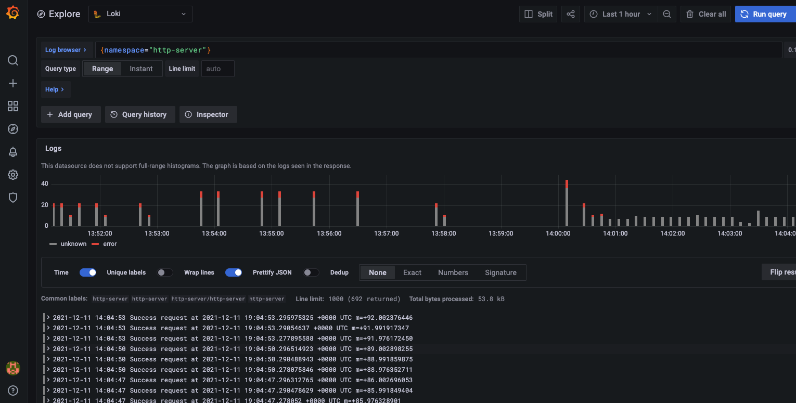
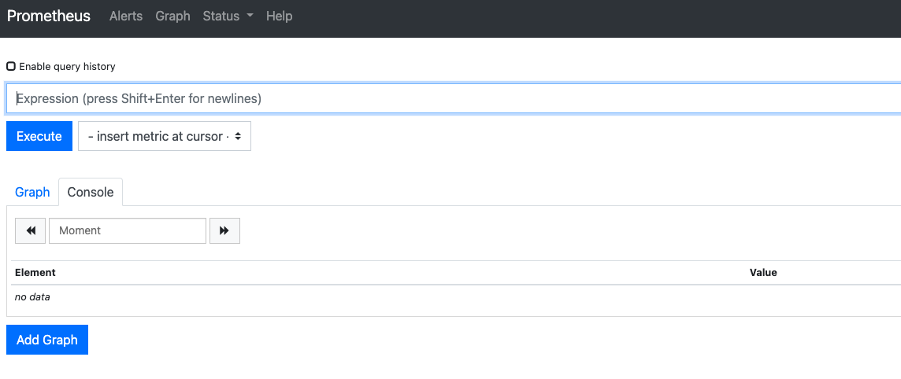
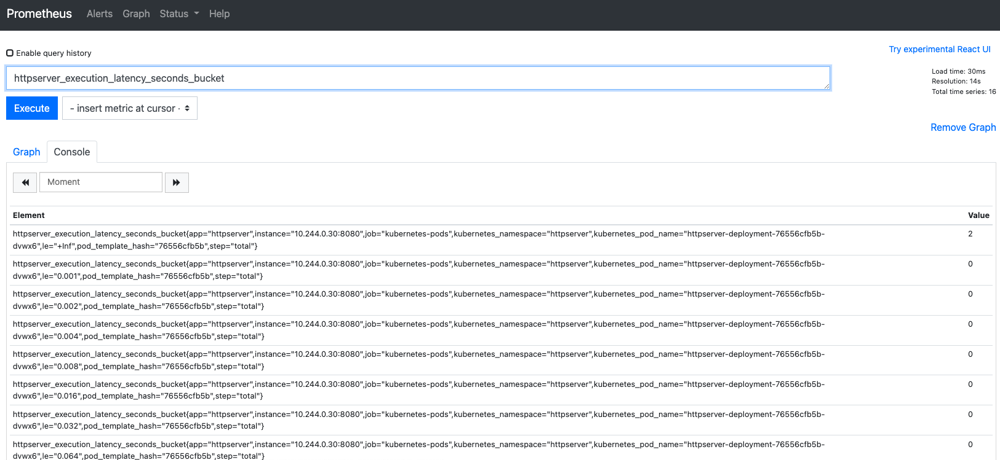
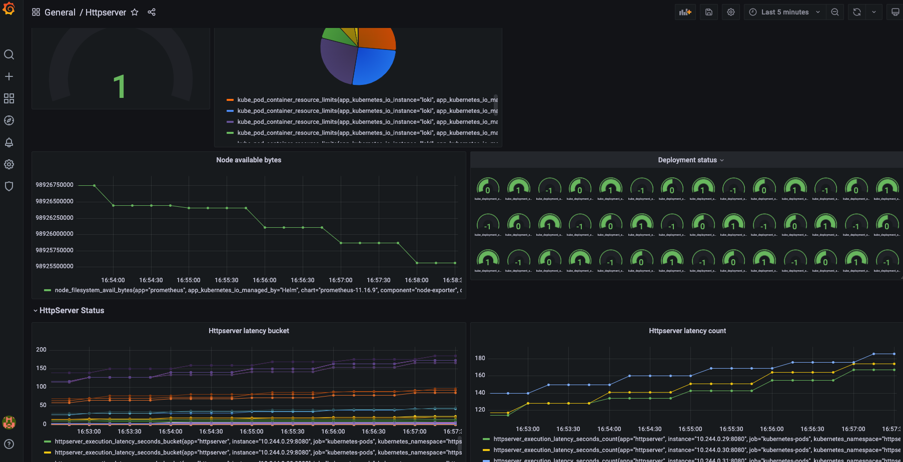

### Module 10 homework
Requirements:
* 为 HTTPServer 添加 0-2 秒的随机延时
 * 详情见代码: https://github.com/tonylixu/go_http_server/blob/main/handlers/handlers.go#L21
* 为 HTTPServer 项目添加延时 Metric
 * 详情见代码: https://github.com/tonylixu/go_http_server/blob/main/handlers/handlers.go#L21
* 将 HTTPServer 部署至测试集群，并完成 Prometheus 配置
 * 详情见： https://github.com/tonylixu/go_http_server/blob/main/module10_README.md#expose-prometheus-server
* 从 Promethus 界面中查询延时指标数据
 * 详情见： https://github.com/tonylixu/go_http_server/blob/main/module10_README.md#expose-prometheus-server
* (可选) 创建一个 Grafana Dashboard 展现延时分配情况
 * 详情见: https://github.com/tonylixu/go_http_server/blob/main/module10_README.md#grafana-dashboard

### Docker Image
The docker image repository is located at:
* https://hub.docker.com/repository/docker/tonylixu/go_http_server

### Promhttp Handler
* Code link: https://github.com/tonylixu/go_http_server/blob/main/main.go#L57

### Metrics Go file
* metrics.go: https://github.com/tonylixu/go_http_server/tree/main/metrics

### Install loki-stack
```bash
$ curl -fsSL -o get_helm.sh https://raw.githubusercontent.com/helm/helm/main/scripts/get-helm-3
$ chmod 700 get_helm.sh
$ ./get_helm.sh
Downloading https://get.helm.sh/helm-v3.7.2-linux-amd64.tar.gz
Verifying checksum... Done.
Preparing to install helm into /usr/local/bin
helm installed into /usr/local/bin/helm
$ helm version
version.BuildInfo{Version:"v3.7.2", GitCommit:"663a896f4a815053445eec4153677ddc24a0a361", GitTreeState:"clean", GoVersion:"go1.16.10"}
```

### Add grafana repository
```bash
$ helm repo add grafana https://grafana.github.io/helm-charts
"grafana" has been added to your repositories

$ helm repo update
Hang tight while we grab the latest from your chart repositories...
...Successfully got an update from the "grafana" chart repository
Update Complete. ⎈Happy Helming!⎈
```

### Install loki-stack
```bash
$ helm pull grafana/loki-stack
$ tar -xvf loki-stack-2.5.0.tgz
$ cd loki-stack
$ grep -rl "rbac.authorization.k8s.io/v1beta1" . | xargs sed -i 's/rbac.authorization.k8s.io\/v1beta1/rbac.authorization.k8s.io\/v1/g'
$ cd ..
$ helm upgrade --install loki ./loki-stack --set grafana.enabled=true,prometheus.enabled=true,prometheus.alertmanager.persistentVolume.enabled=false,prometheus.server.persistentVolume.enabled=false
Release "loki" does not exist. Installing it now.
W1211 14:25:57.718061   24546 warnings.go:70] policy/v1beta1 PodSecurityPolicy is deprecated in v1.21+, unavailable in v1.25+
W1211 14:25:57.719797   24546 warnings.go:70] policy/v1beta1 PodSecurityPolicy is deprecated in v1.21+, unavailable in v1.25+
W1211 14:25:57.721368   24546 warnings.go:70] policy/v1beta1 PodSecurityPolicy is deprecated in v1.21+, unavailable in v1.25+
W1211 14:25:57.722860   24546 warnings.go:70] policy/v1beta1 PodSecurityPolicy is deprecated in v1.21+, unavailable in v1.25+
W1211 14:25:57.824717   24546 warnings.go:70] policy/v1beta1 PodSecurityPolicy is deprecated in v1.21+, unavailable in v1.25+
W1211 14:25:57.825365   24546 warnings.go:70] policy/v1beta1 PodSecurityPolicy is deprecated in v1.21+, unavailable in v1.25+
W1211 14:25:57.825524   24546 warnings.go:70] policy/v1beta1 PodSecurityPolicy is deprecated in v1.21+, unavailable in v1.25+
W1211 14:25:57.827457   24546 warnings.go:70] policy/v1beta1 PodSecurityPolicy is deprecated in v1.21+, unavailable in v1.25+
NAME: loki
LAST DEPLOYED: Sat Dec 11 14:25:56 2021
NAMESPACE: default
STATUS: deployed
REVISION: 1
NOTES:
The Loki stack has been deployed to your cluster. Loki can now be added as a datasource in Grafana.

See http://docs.grafana.org/features/datasources/loki/ for more detail.

$ k get po
NAME                                            READY   STATUS    RESTARTS   AGE
loki-0                                          1/1     Running   0          98s
loki-grafana-564bfc78f5-k2bqt                   1/1     Running   0          98s
loki-kube-state-metrics-5cc65f8b4-pkv6j         1/1     Running   0          98s
loki-prometheus-alertmanager-54bbd44b98-lwgt9   2/2     Running   0          98s
loki-prometheus-node-exporter-f4bnf             1/1     Running   0          98s
loki-prometheus-pushgateway-75bcfd77bc-r6tk2    1/1     Running   0          98s
loki-prometheus-server-5cf84b64cf-26xxg         2/2     Running   0          98s
loki-promtail-tnwbr                             1/1     Running   0          98s
```

### Access grafana url
```bash
# Update svc type to NodePort
$ k edit svc loki-grafana
$ k get svc
NAME                            TYPE        CLUSTER-IP       EXTERNAL-IP   PORT(S)        AGE
kubernetes                      ClusterIP   10.96.0.1        <none>        443/TCP        11m
loki                            ClusterIP   10.107.65.27     <none>        3100/TCP       5m36s
loki-grafana                    NodePort    10.108.243.191   <none>        80:30339/TCP   5m36s
loki-headless                   ClusterIP   None             <none>        3100/TCP       5m36s
loki-kube-state-metrics         ClusterIP   10.98.58.192     <none>        8080/TCP       5m36s
loki-prometheus-alertmanager    ClusterIP   10.108.52.140    <none>        80/TCP         5m36s
loki-prometheus-node-exporter   ClusterIP   None             <none>        9100/TCP       5m36s
loki-prometheus-pushgateway     ClusterIP   10.104.17.17     <none>        9091/TCP       5m36s
loki-prometheus-server          ClusterIP   10.110.163.119   <none>        80/TCP         5m36s
```
Now you can assess the url by http://<IP>:30339/. User name and password is in loki-grafana
```bash
$ k get secret loki-grafana
```

### Verify grafana is up and running
* Grafana web UI


### Deploy new code to k8s
```bash
$ k create -f k8s/module10.yaml

$ k get po -n http-server
NAME                                      READY   STATUS    RESTARTS   AGE
http-server-deployment-66d4fbc946-2r2b5   1/1     Running   0          7m32s
http-server-deployment-66d4fbc946-fpp2c   1/1     Running   0          7m32s
http-server-deployment-66d4fbc946-hqznz   1/1     Running   0          7m32s

$ k get svc -n http-server
NAME                  TYPE        CLUSTER-IP       EXTERNAL-IP   PORT(S)   AGE
http-server-service   ClusterIP   10.111.177.185   <none>        80/TCP    7m56s

$ curl http://10.111.177.185/metrics
# HELP go_gc_duration_seconds A summary of the pause duration of garbage collection cycles.
# TYPE go_gc_duration_seconds summary
go_gc_duration_seconds{quantile="0"} 4.0942e-05
go_gc_duration_seconds{quantile="0.25"} 4.0942e-05
go_gc_duration_seconds{quantile="0.5"} 8.7557e-05
go_gc_duration_seconds{quantile="0.75"} 8.7557e-05
go_gc_duration_seconds{quantile="1"} 8.7557e-05
go_gc_duration_seconds_sum 0.000128499
go_gc_duration_seconds_count 2
# HELP go_goroutines Number of goroutines that currently exist.
# TYPE go_goroutines gauge
go_goroutines 10
# HELP go_info Information about the Go environment.
# TYPE go_info gauge
go_info{version="go1.17.3"} 1
# HELP go_memstats_alloc_bytes Number of bytes allocated and still in use.
# TYPE go_memstats_alloc_bytes gauge
....
```

### Expose prometheus server
```bash
$ k edit svc loki-prometheus-server
service/loki-prometheus-server edited
ubuntu@ip-172-31-82-231:~/go_http_server/k8s$ k get svc
NAME                            TYPE        CLUSTER-IP       EXTERNAL-IP   PORT(S)        AGE
kubernetes                      ClusterIP   10.96.0.1        <none>        443/TCP        50m
loki                            ClusterIP   10.107.65.27     <none>        3100/TCP       45m
loki-grafana                    NodePort    10.108.243.191   <none>        80:30339/TCP   45m
loki-headless                   ClusterIP   None             <none>        3100/TCP       45m
loki-kube-state-metrics         ClusterIP   10.98.58.192     <none>        8080/TCP       45m
loki-prometheus-alertmanager    ClusterIP   10.108.52.140    <none>        80/TCP         45m
loki-prometheus-node-exporter   ClusterIP   None             <none>        9100/TCP       45m
loki-prometheus-pushgateway     ClusterIP   10.104.17.17     <none>        9091/TCP       45m
loki-prometheus-server          NodePort    10.110.163.119   <none>        80:32044/TCP   45m
```
You can also check the prometheus web UI now.
* loki-prometheus screenshot


### Check httpserver delayed metrics
* Delayed metrics



### Grafana Dashboard
* Httpserver grafana dashboard screenshot

